# Railway Deployment Architecture

## Overview

This document describes the Railway deployment architecture for the Turborepo monorepo application featuring a unified Nitro server deployment with PostgreSQL database and Cloudflare CDN integration.

## Architecture Diagram

```mermaid
graph TB
    subgraph "Users"
        U[👥 Users]
    end
    
    subgraph "Cloudflare CDN"
        CF[🌐 Cloudflare Edge Locations]
    end
    
    subgraph "Railway Platform"
        subgraph "Application Service"
            NS[🚀 Nitro Server]
            subgraph "Static Assets"
                SA[📁 React SPA /]
            end
            subgraph "API Routes"
                TR[🔄 tRPC /api/trpc]
                AU[🔐 Auth /api/auth]
                HE[❤️ Health /api/health]
            end
        end
        
        subgraph "Database"
            PG[(🐘 PostgreSQL)]
        end
        
        subgraph "Private Network"
            PN[🔒 Railway Internal Network]
        end
    end
    
    subgraph "Development"
        DEV[💻 Local Development]
        CLI[⚡ Railway CLI]
    end

    U --> CF
    CF --> NS
    NS --> SA
    NS --> TR
    NS --> AU
    NS --> HE
    NS -.-> PG
    PG -.-> PN
    NS -.-> PN
    
    DEV --> CLI
    CLI --> NS
    
    style CF fill:#ff9500
    style NS fill:#0066cc
    style PG fill:#336699
    style PN fill:#333
```



## Components

### 1. Application Service (Railway)

**Technology Stack:**
- **Runtime**: Node.js 20 (Alpine Linux)
- **Framework**: Nitro (UnJS)
- **Frontend**: React SPA with TanStack Router
- **API**: tRPC with Better Auth
- **Build Tool**: Vite + Turborepo
- **Package Manager**: pnpm with workspaces

**Configuration:**
```json
{
  "build": {
    "builder": "nixpacks",
    "buildCommand": "pnpm install --frozen-lockfile && pnpm db:generate && pnpm --filter @repo/api build"
  },
  "deploy": {
    "startCommand": "cd apps/api && node .output/server/index.mjs"
  }
}
```

**Port Configuration:**
- Production: `3000` (Railway managed)
- Development: `3001` (local API) + `5173` (local frontend)

### 2. Database (Railway PostgreSQL)

**Specifications:**
- **Type**: Managed PostgreSQL
- **Connection**: Private network within Railway
- **Environment**: `DATABASE_URL` automatically injected
- **Schema Management**: Prisma migrations
- **Backup**: Railway managed (7-day retention)

**Connection Security:**
- Private network communication
- No external database access
- Automatic SSL encryption

### 3. CDN (Cloudflare Integration)

**Features:**
- Global edge caching
- Automatic compression
- Static asset optimization
- DDoS protection
- SSL termination

**Cache Strategy:**
- **Static Assets** (JS/CSS/Images): 1 year cache with immutable headers
- **HTML Files**: No cache (for SPA routing)
- **API Routes**: No cache (dynamic content)

## Deployment Flow


## File Structure

```
├── apps/
│   ├── api/                    # Nitro API server
│   │   ├── src/
│   │   │   ├── api/trpc/       # tRPC endpoints
│   │   │   ├── api/auth/       # Better Auth routes
│   │   │   └── plugins/        # Nitro plugins (CORS, etc.)
│   │   └── nitro.config.ts     # Unified deployment config
│   └── web/                    # React frontend
│       ├── src/
│       └── dist/               # Build output (served by Nitro)
├── packages/
│   ├── database/               # Prisma schema & migrations
│   ├── trpc/                   # Shared tRPC definitions
│   └── auth/                   # Better Auth configuration
├── tooling/
│   └── infra/                  # Railway deployment scripts
├── .env.prod.example          # Production environment template
├── .env.prod                  # Production environment (create from template)
└── railway.json               # Railway configuration
```

## Environment Configuration

### Required Environment Variables

| Variable | Purpose | Example |
|----------|---------|---------|
| `DATABASE_URL` | PostgreSQL connection | Auto-injected by Railway |
| `BETTER_AUTH_SECRET` | Authentication secret | 32+ character string |
| `BETTER_AUTH_URL` | Auth callback URL | `https://app.railway.app` |
| `NODE_ENV` | Runtime environment | `production` |
| `PORT` | Application port | `3000` |

### Optional Environment Variables

| Variable | Purpose | Default |
|----------|---------|---------|
| `LOG_LEVEL` | Logging verbosity | `info` |
| `CORS_ORIGINS` | Allowed origins | Not needed for unified deployment |
| `SESSION_MAX_AGE` | Session timeout | `7200000` (2 hours) |

## Security Considerations

### Network Security
- **Private Database**: Only accessible within Railway network
- **HTTPS Only**: All traffic encrypted via Railway/Cloudflare
- **No Direct DB Access**: Database not exposed to internet

### Application Security
- **Session-based Auth**: Better Auth with secure cookies
- **CORS Protection**: Configured for same-origin requests
- **Environment Isolation**: Production secrets separate from development

### Content Security
- **Static Asset Integrity**: Immutable cache headers
- **XSS Protection**: Security headers via Nitro
- **CSRF Protection**: Better Auth built-in protection

## Scaling Strategy

### Horizontal Scaling
- **Auto-scaling**: Railway can scale based on CPU/memory usage
- **Database**: Managed PostgreSQL scales independently
- **CDN**: Cloudflare provides global edge distribution

### Cost Optimization
1. **Single Service**: Unified deployment reduces service count
2. **Efficient Caching**: Cloudflare reduces Railway bandwidth costs
3. **Resource Limits**: Appropriate CPU/memory allocation
4. **Database Optimization**: Connection pooling and query optimization

## Monitoring & Maintenance

### Health Checks
- **Endpoint**: `GET /api/health`
- **Frequency**: Every 30 seconds
- **Metrics**: Uptime, memory usage, database connectivity

### Logging
- **Level**: Configurable via `LOG_LEVEL`
- **Format**: Structured JSON logs
- **Retention**: Railway dashboard (30 days)

### Metrics
- **Application**: Response time, error rate, throughput
- **Database**: Connection count, query performance
- **CDN**: Cache hit rate, bandwidth savings

## Disaster Recovery

### Backup Strategy
- **Database**: Railway automated backups (7 days)
- **Code**: Git repository as source of truth
- **Environment**: Infrastructure as Code in `tooling/infra/`

### Recovery Procedures
1. **Application Failure**: Railway auto-restart + health checks
2. **Database Issues**: Railway managed recovery
3. **Complete Outage**: Redeploy from Git using Railway CLI

## Cost Analysis

### Monthly Estimates (USD)

| Component | Usage | Cost |
|-----------|-------|------|
| Railway Service | 1 service, moderate traffic | $5-20 |
| PostgreSQL | Shared instance | $5-10 |
| Cloudflare | CDN + security | $0 (free tier) |
| **Total** | | **$10-30/month** |

### Cost Optimization Benefits
- **75% bandwidth savings** via Cloudflare CDN
- **Single service** vs separate frontend/API services
- **Managed database** vs self-hosted PostgreSQL
- **Auto-scaling** prevents over-provisioning

## Deployment Commands

```bash
# Initial setup (one-time)
pnpm infra:setup

# Configure environment
cp .env.prod.example .env.prod
# Edit .env.prod with your values

# Deploy application
pnpm infra:deploy

# Monitor deployment
pnpm infra:status
pnpm infra:logs

# Database management
railway run pnpm db:studio
railway run pnpm db:deploy
```

## Troubleshooting

### Common Issues

1. **Build Failures**
   - Verify `pnpm db:generate` runs locally
   - Check Turborepo workspace dependencies

2. **Database Connection**
   - Ensure `DATABASE_URL` is auto-set
   - Verify migrations run successfully

3. **Static Assets Not Loading**
   - Check Nitro `publicAssets` configuration
   - Verify frontend build output location

4. **Authentication Issues**
   - Confirm `BETTER_AUTH_SECRET` is set
   - Verify `BETTER_AUTH_URL` matches deployment URL

### Support Resources
- [Railway Documentation](https://docs.railway.app)
- [Nitro Documentation](https://nitro.unjs.io)
- [Better Auth Documentation](https://better-auth.com)
- [Cloudflare Integration Guide](https://docs.railway.app/guides/cloudflare)

---

**Last Updated**: October 2024  
**Architecture Version**: 1.0  
**Deployment Target**: Railway + Cloudflare